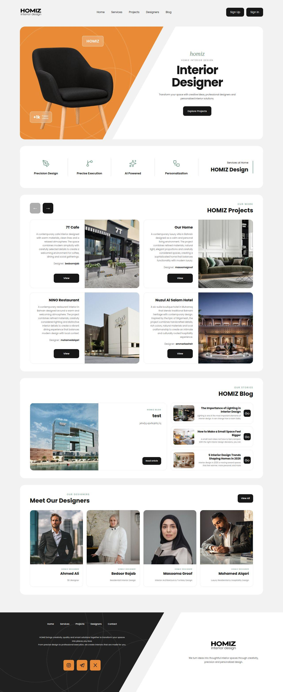
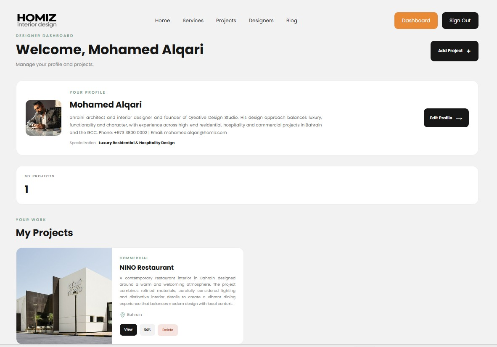
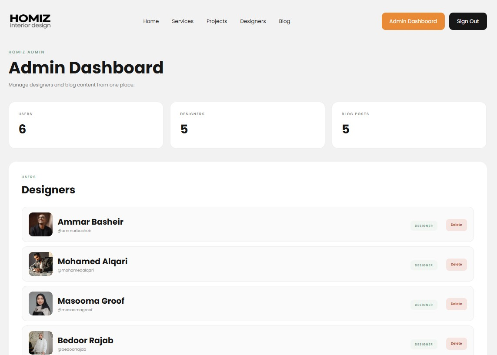

# HOMIZ - Interior Design Platform

HOMIZ is an interior design platform where users can explore designers, projects, services, and design ideas.

## Screenshots

### Home Page

### Designer Dashboard

### Admin Dashboard

---

## Project Planning

### User Stories

The user stories describe what visitors, users, and designers can do on the platform.

[View User Stories](planning/user-stories.md)

### Wireframes

The wireframes show the main pages and layout of the platform.

### ERD

The Entity Relationship Diagram shows the database entities and their relationships.

---

## Main Features

- Browse interior design projects
- Browse interior designers
- View project details
- View available services
- Read interior design blog posts
- Create a designer account
- Sign in and sign out
- Manage designer profile
- Upload profile images
- Create projects
- Edit projects
- Delete projects
- Designer dashboard
- Admin dashboard
- Manage designers
- Create, edit, and delete blog posts
- Upload project and blog images

---

## Technologies Used

- JavaScript
- Node.js
- Express.js
- MongoDB
- Mongoose
- EJS
- CSS
- Cloudinary
- Multer
- Express Session
- Method Override

---

## Getting Started

### Deployed Application

[Visit HOMIZ](https://homiz.onrender.com)

### GitHub Repository

[View HOMIZ on GitHub](https://github.com/AhKhamis/HOMIZ-Interior-Designer-Platform.git)

### Planning Materials

- [User Stories](planning/user-stories.md)
- [Wireframes](planning/wireframes.png)
- [ERD](planning/erd.jpg)

---

## How HOMIZ Works

HOMIZ provides a platform where visitors can discover interior designers, explore their projects, and read interior design content.

Designers can create an account, build their profile, upload a profile image, and manage their projects through their dashboard.

Administrators can manage designers and blog content through the admin dashboard.

---

## Attributions

- Cloudinary is used for image hosting and image uploads.
- Lucide is used for interface icons.
- Images used in the project are used for demonstration and project presentation purposes.

---

## Future Improvements

- Add designer search and filtering
- Add project categories and filtering
- Add user interaction with designers
- Add project likes and favorites
- Improve mobile navigation
- Add more advanced AI-powered interior design features
