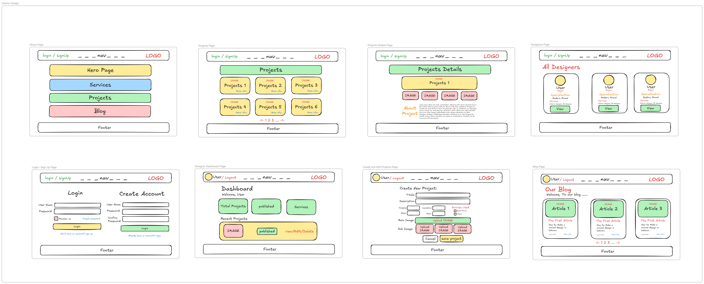
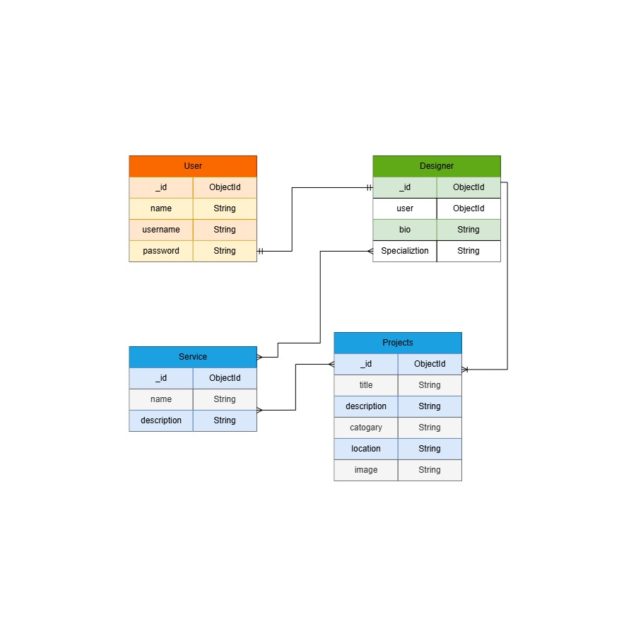

# HOMIZ - Interior Design Platform

HOMIZ is an interior design platform where users can explore designers, projects, services, and design ideas.

## Project Planning

### User Stories

The user stories describe what visitors, users, and designers can do on the platform.

[View User Stories](planning/user-stories.md)

---

### Wireframes

The wireframes show the main pages and layout of the platform.

---

### ERD

The Entity Relationship Diagram shows the database entities and their relationships.

---

## Main Features

- Browse interior design projects
- Browse designers
- View available services
- View project details
- Designer dashboard
- Create, edit, and delete projects
- Browse design Blog
